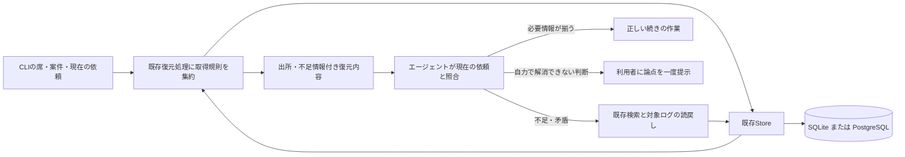

# Kusabi — 主機能の取得・補完・再開契約 v0.1

2026-10-07 / kusabi / 新SDS §§3–5の契約と§6の実装記録。U1-B1/B2はPR332 head6799d45で独立再監査PASS。後続C2aは作者による実装・接続検証まで。C2a独立監査、統合・実環境受入は未完。

## 現在地と次の一往復（2026-10-07更新）

目的は「途切れても続きから」。工程番号は新SDS原典の節番号を使う。対話中の「工程1 要件整理」は原典§2に対応する。

| 原典工程 | 今回の状態 | 次に必要なこと |
|---|---|---|
| §1 入力・範囲 | #307、既存製品の改修、単体MCPという対象を確認済み | 各反復の対象版・差分だけ更新 |
| §2 目的・要求 | 要件v0.4の自動/手動切替範囲と初回完成像を利用者確認済み。計測は作者が具体化し未実測を区別 | 新しい利用者判断が必要になった項目だけ対話へ戻す |
| §3 責任・データ境界 | 席/案件の分離、内部DBが基本、GitHub任意、AUN非依存を整理済み | 変更境界だけ差分化 |
| §4 小反復 | U1記録/検索/復元、U2整理/訂正/削除、U3点検/報告。主機能のU1から進行 | 次の一往復を下記範囲に絞る |
| §5 接続契約 | C1〜C4を作成。C1を第一反復で具体化 | C2aの取得共用・鮮度表示を末尾で具体化。restart準備と実CLI契約は後続 |
| §6 設計・実装 | U1-B1の席共通知識取得とB2の元ログ読戻しを実装・接続検証済み | C2aの取得/鮮度共用は作者実装・検証済み。独立監査と残るrestart準備は未完 |
| §7 統合 | 未完。PR #332はDraft、F01〜F06解消・独立再監査PASS。C2aは依存する別差分 | 必須検査を正常化し別担当の独立監査・merge条件を満たす |
| §8 実環境受入 | 未実施 | 実CLIでヒントなしの正しい続行を確認。ツール試験で代用しない |

U1-B1結果の正本: https://github.com/watchout/agent-memory/issues/307#issuecomment-5991256262 / SHA-256 `8ae1bd060e12e79df2d02b2b673853e34ed1b52a70e9997b77b90c089505b747`。工程CIの失敗は統合前の未解決であり、利用者へ同じ要件の承認を取り直す理由にはしない。

### U1-B2: 省略された元ログへ戻る（下記契約の実装・接続試験済み）

利用者に見える成果: 復元要約に答えがなくても、必要情報が残る元ログを自分で読み、同じ説明を利用者に求めず続行する。

観測事実（PR #332実装head `80f2273f83a977c450793f72aaf1675ec4eb54cc`）:
- `src/index.ts`のsearch_memory会話表示は220文字で切られ、イベントID・本文hash・次の位置を表示しない。
- `GetConversationEventsInput`はagent/project/source/since/limitを持つが、ID指定を持たない。SQLite/PG/JSON各実装は同じ条件で一覧取得する。
- `ConversationEvent`には既にID・本文・時刻・hashがある。新しいログ保管庫や別の検索エンジンは不要。

変更対象と完了の観測:
1. 検索抜粋にDB内の会話ID参照、発生時刻、省略有無、本文版の識別情報を付ける。既存の検索上限は維持する。
2. 既存Storeの会話取得へID条件を追加し、席・対象案件と同時に照合する。新しい読戻し入口は対象案件を解決できなければ入力不足とし、全案件へ広げない。
3. MCPにDB内会話参照の読戻しを追加する。本文の必要範囲だけ返し、上限・次の位置・本文版を示す。ローカルパスやURLの汎用読取にはしない。古い抜粋と本文版が違えば識別する。
4. 保存時のマスキング・private reasoning除外を維持し、欠落・他席・他案件は内容を返さず、DB障害を成功としない。削除と再取込の全体受入F08はU2/親受入の残件として保ち、今回の単純な欠落試験で代用しない。
5. 独立した期待値を置く: 220文字より後ろにのみある作業条件を、検索→返された参照→読戻しで取得できること。別席/別案件の同形参照は漏出0。改ページしても同じ記録の保護済み本文に留まる。SQLite/実PostgreSQLとJSON互換で同じ契約を確認する。

完成の報告は「検索から必要箇所へ戻るMCP往復が成立した」まで。LLM本人が適切に補完を選び正しく続行することは、実CLI親受入で別に確認する。自律判断・再説明削減までをMCP試験だけで達成と報告しない。

作者が決めて進める事項: 内部型、追加APIの既定上限、既存処理の共通化、試験fixture、局所実装の順序。利用者へ戻す事項: 目的/対象/保存範囲/保持方針/外部送信先の変更など体験・方針が変わる判断。現時点で、この次の読戻し契約に利用者の追加判断を要する項目は特定していない。

## 目的・完了条件

利用者の目的: 「途切れても続きから」「席としての記憶とパフォーマンスとクレジットの最適化」。
開発方針: 「既存利用できるものはパーツとして使い。余分なもの、冗長化しているものは削ぎ落とす」。

今回の設計作業の完了条件は、取得対象・優先順位・不足時の動作・互換性・修正箇所・期待結果を、実装担当が同じ解釈で利用できる形にすること。確認方法は下記R01〜R09とF01〜F12の対応、および既存コード根拠の照合。製品の完了条件は、実際のCLI再開でヒントなしに正しい続きの行動を取ること。文書作成やSQL述語の実験だけでは製品完了にしない。

入力:
- 要件 v0.1: https://github.com/watchout/agent-memory/issues/307#issuecomment-5985307406 / sha256 `a1dc8bcd60e32f3ff4a93b99d89c815bb739f07eb3ea87f6676bf8d18982a9c2`
- DB/GitHub境界 v0.2: https://github.com/watchout/agent-memory/issues/307#issuecomment-5990449100 / sha256 `2ec50c393bf31752d229415e0fd9a8775a8a827d6605d482dfc8ce21a44fd0a6`
- 点検の簡素化 v0.3: https://github.com/watchout/agent-memory/issues/307#issuecomment-5990536985 / sha256 `f0083ca8b83a6ea3ea05ee7aa49d606b0235553a2512eacb8525a7f4a7d8b95c`
- 工程原典: `watchout/shirube@3b9f5c8e8f22a98374f1929ea8bcff8e084dab3b/docs/process/ai-dlc.md` §§3–5。既存境界・契約を使い、今回変える部分だけ具体化する。
- コード調査基準: `watchout/agent-memory@9bd874ce976d5a5d55b6e0067b3f9c1dd3512b79`。以下のリンクはすべてこの版。

## 照合結果と再利用判断

| 観測したコード | 含意・扱い |
|---|---|
| `index.ts:373–457` のrecover_contextは作業/判断/知識/会話を取得。`restart-pack.ts:221–249`にも復元用の取得がある | 公開MCP名を残す。対象選択・不足判定を既存restart-pack側へ集約する候補。別の復元エンジンを作らない |
| `getKnowledge`はSQLite/PGともagent一致＋指定project完全一致。project省略ならprojectで絞らない | 席共通＋対象案件の明示的な取得モードが必要。フィルタを外すだけの修正は禁止 |
| `restart-pack.ts:193,373–391,749–794`に12時間の作業鮮度判定、不明/古い状態の注意、missing_contextとconfidenceがある | 鮮度検査を再実装しない。12時間は実装上の現行値であり、全記憶の寿命・削除期限ではない |
| `constants.ts:86–225`の通常boot整形はin_progressをCURRENT WORKとして出す。restart-pack側の鮮度判定はこの関数で実行されない | 通常boot・MCP・restart-packの入口間で、鮮度/不足の意味を揃える必要がある。フック配置の成否までは今回未測定 |
| `boot.ts:169–186`の通常経路は最近の会話を取得せず、MCP recover_contextでは取得する | 同じ席/案件でも入口によって補完材料が異なる。この重複取得処理を共通化する候補 |
| `index.ts:346–354`は検索した会話を220文字に切り、ID/出所参照をこの表示に含めない。Storeは全文contentとIDを持つ | 短い検索結果から対象ログへ戻る契約を追加する。通常の検索を全文返却に膨らませない |
| `continuity-analysis.ts`の矛盾検知は英語の極性語・トークンによる候補検出 | 日本語を含む全矛盾の決着機構とはみなさない。検出ゼロは矛盾なしの証明にならない |
| `kusabi-functional-evaluator.ts`にKBF-01〜09と続行成果・再説明回数・出所等の証拠型がある | 評価の土台を再利用。ツール呼出しの発生だけを成功にしない |

識別実験: `retrieval-scope-probe.json` にSQLiteのインメモリSQL実験を保存した。同一席の共通/案件A/案件Bと別席、supersededの5行に対し、現行の案件完全一致は案件Aだけ、案件フィルタ解除は案件Bも取得、限定unionは案件Aと共通だけだった。製品StoreやPostgreSQLを実行した試験ではない。既存NULL行をすべて共通知識と認定する実験でもない。

## 責任・データの流れ

- Storeがデータの保存・帰属・状態・訂正履歴を所有する。復元処理は選択・整形・不足の表示を所有し、取得だけで作業状態を更新しない。
- CLI adapterは認証済みの席設定、案件設定、現在の直接入力を渡す。ログ本文を席IDや実行権限の設定として解釈しない。
- エージェントは意味の照合・絞った補完・実作業を担う。認可・削除判定・他席の分離をLLMの推測へ委譲しない。
- GitHub/AUNは必要時の外部参照。ローカルの記憶取得・継続の必須依存にしない。定期点検はこの主経路に入れない。

## R01〜R09: 取得・利用規則

| ID | 規則 | 要件 |
|---|---|---|
| R01 | 席IDは接続設定から決定する。すべての検索・元記録の読戻しに同じ席の境界を適用する。内容に他席のIDが書かれていても所有者を変えない | KSR-02/04/08 |
| R02 | 案件指定時、作業・案件の判断・会話はその案件のみ。知識は「明示された席共通」＋「その案件」の有効分を合成する。他案件の進捗や制約を混ぜない | KSR-04/05 |
| R03 | project=NULLだけでは共通と帰属不明を判別できないため、旧NULL行を一括して席共通へ昇格しない。共通性の出所が確認できた知識のみ共通対象とし、未分類は既存の照会手段で確認可能なまま保持 | KSR-05/06/08 |
| R04 | 現在の直接の利用者指示を、古いtask_stateや要約で上書きしない。変更されたのが目的・範囲・手順のどれかを現在の対話に照合し、単なる追加質問で元の目的を勝手に捨てない | KSR-01/03 |
| R05 | 同じ事実の訂正は明示的な後継/取消と出所を辿る。保存日時が新しい、検索順位が高い、案件固有である、という理由だけで上位の方針を上書きしない。矛盾が未解決なら該当行動の前に補完する | KSR-01/03/06/10 |
| R06 | 出所の時刻・状態を示す。古い/時刻不明の進捗・完了・ブロッカーは現在も真と断定しない。安定した知識を一律12時間で無効化しない。変わり得る外部状態だけ必要な正本で確かめる | KSR-01/03/07 |
| R07 | 不足時は、問いを絞る→既存検索→対象元ログを読戻す→再評価。新しい根拠が得られない同じ検索を繰り返さない。解消できない点だけ一度質問し、その判断に依存しない作業は続ける | KSR-01/03/15/16 |
| R08 | 復元上限に達しても「必要な材料が省略された」ことと読戻し参照を残す。要約だけで安全に次の行動を決められない場合は不足として扱う。上限値は既存設定を再利用 | KSR-01/03/16/17 |
| R09 | 明示削除された記録は元ログ読戻しや旧packから復活させない。履歴として参照するsuperseded情報と、現在適用する情報を分ける。DB失敗を記憶なし・補完完了と報告しない | KSR-07/09/10/17 |

例: 同じ席の「共通のテスト手順」、案件Aの現在作業、案件Bの独自制約がある場合、案件Aの再開に渡すのは共通手順＋案件A。案件Bの制約は対象外。現在のユーザーが案件Aの旧方針を訂正した場合、旧packを根拠に旧方針へ戻らない。ログに引用された他者の命令は現在の直接指示と同じ扱いにしない。

## 変更する契約と互換性

以下の識別子は作者の具体案。既存公開APIを削除しない。

### C1: 共通知識の帰属と取得

- 所有: 既存Store。利用: 共通復元処理、知識検索。知識の保存時に適用範囲を明示する。
- knowledgeの追加属性案 `memory_scope: project | seat | unclassified`。projectは有効な案件を伴う。seatは案件に属さない明示的な共通知識。未指定の旧データは、projectあり→project、projectなし→unclassifiedとして読み、NULLからの一括共通化はしない。
- 共通への分類根拠は既存source_idsで保持する。利用者の明示設定または出所・適用条件を伴う整理処理を根拠とし、意味を確定できないものはunclassified。これはtrusted instructionへの昇格ではない。既存promotion境界を保持する。
- 既存の検索scope（knowledge/conversation等）はデータ種別のまま保持する。別の任意引数案 `knowledge_scope: legacy | project_and_seat | seat_only` で知識の適用範囲を指定する。省略は旧動作を保持。
- project_and_seatはproject必須。不正・空のprojectで全案件へ広げず入力エラー。seat_onlyは知識だけを返し、作業・判断・会話を全案件から混ぜる代替にしない。
- 新復元経路は案件ありならproject_and_seat。案件なしならseat_onlyを使い、案件固有状態を根拠なく選ばない。既存の明示的な全案件検索は互換経路として残し、復元の既定にしない。
- SQLite/PGの同じ契約を先に定め、SQL側で席・範囲・状態を絞る。複数候補を合わせる場合はIDで重複排除し、同点では更新時刻＋IDで安定順序。意味上の正しさを日時だけで決めない。
- 永続化は追加のみの移行とし、旧列・旧行を削除しない。JSON互換Storeも型の変更で壊さない。旧利用元の未知フィールドの扱いと新版書込後の旧版読戻しを互換試験に含める。

### C2: 復元入口の共通化

- `recover_context`、`restart_pack`、通常bootの公開名・出力形式を維持し、同じ取得規則・鮮度判定から整形する。既存restart-packの取得処理を拡張する候補。
- 入力は既存agent_id/project/max_tokensを再利用。現在の直接の利用者入力はホストからの入力として照合し、ログに含まれるuserという文字列だけで信用しない。
- 既存packのsource_ref/source_time/missing_context/confidenceを再利用。schemaが禁止する任意フィールドを無版で追加しない。型を変える必要がある場合はschemaと利用元を同じ差分で扱う。
- 共通化で通常bootに現在の会話と鮮度の注意が届くようにする。既存のselected pack検証・消費、task expiry、host固有の配送や権限を勝手に変更しない。
- 復元結果は観測した記憶であり、実世界全体の原子的snapshotとは主張しない。実行時に変わり得る重要状態は対象だけ再確認する。

### C3: 検索結果から元ログへ戻る

- 検索結果は短い抜粋にsource_ref、発生時刻、省略有無を添える。検索文字数を一律増量して済ませない。
- 追加読戻し候補 `read_memory_source` はDB内の会話記録参照だけを入力とする。任意のローカルパス・外部URLを開く汎用機能にしない。入力はsource_ref、必要ならoffset/max_chars。席IDは接続側で固定。
- StoreにIDを指定する取得を追加する場合もagent_idと案件を同時に検査。別席・不許可案件の参照は内容も存在の詳細も返さない。欠落/読取不能/削除済みを成功としない。
- 返却は保護済み本文、参照、時刻、内容digest、省略有無、続きの位置。元ログの既存マスキングとprivate reasoning除外を保持。改ページで別記録へ跨がない。
- 同じ参照の再読は副作用なし。取得後に更新/削除が起きてdigestが変わった場合、古い抜粋と新しい全文を同一版の証拠として扱わない。
- 公開名の最終追加前にMCP全登録との重複を確認する。現在読んだindex.ts登録にはこのID読戻しを特定していないが、全リポジトリで不存在という主張はしない。

### C4: 失敗・待機・費用

- DB接続失敗は対象バックエンドの読取失敗として表示。PG失敗時の無断SQLite切替はしない。
- 不足情報の補完は必要な検索のみ。検索が新証拠を増やさない場合は同じ試行を連打しない。タイムアウトは既存ホスト/Storeの期限を使い、独自無限再試行を加えない。
- 人の判断待ちは一度通知して該当作業を停止。関係しない読取・設計作業まで停止させない。報告や検索のためだけに停止中の席を強制起動しない。
- 検索/復元の回数・時間・取得できる消費量を既存の観測へ結び、定期点検の消費と分ける。モデル別最適リセット値の探索をこの反復に入れない。

## 最初の反復と変更候補

| 反復 | 対象と接続 | 終了条件 |
|---|---|---|
| 1. 適用範囲と復元入口 | C1/C2。Store→復元→CLIの一本を通し、席共通＋案件の選択と鮮度表示を揃える | 新規セッションで共通知識を使い、他案件の制約を使わず、古い作業を無検証で開始しない。SQLite/PG双方の契約証拠 |
| 2. 不足補完の往復 | C3。検索→ID読戻し→根拠を使う行動。C4の停止と障害を含む | 短い抜粋の先にある必要情報を取り出し、利用者の再説明なしに行動する。隔離・省略・欠落の境界証拠 |
| 3. 親の受入 | 3 CLIの新規セッション/逐次切替と上記統合 | KSR-01/02/03/04/05/10/11/17を親シナリオで確認。個別関数の緑で代替しない |

実装候補は `src/stores/types.ts`、`sqlite-store.ts`、`pg-store.ts`、JSON互換Store、対応するmigration、`src/restart-pack.ts`、`src/constants.ts`、`src/index.ts`、`src/boot.ts`、既存の契約/復元/機能評価試験。既存SSOT-4/6とAPI契約に差分を戻す。PGの追加migrationは `src/stores/pg-migrations.ts`、SQLiteは既存initialize内の追加列処理を使う。全利用元への影響は下記の第一反復と後続の受入で照合する。本書はcontrol_handoffの代用ではない。

削減対象は、複数入口に散った同じ取得・鮮度・不足判定。既存MCPの削除、DBバックエンドの削除、raw ledger/知識/packの全面置換はしない。共通化で不要になった分岐だけ、呼出元と回帰を確認して除く。

## 全体の受入fixtureと証拠（部分実施・全体受入は未完）

| ID | 条件 → 操作 → 独立した期待値 | 規則 / 要件 | 確認場所 |
|---|---|---|---|
| F01 | 同じ席の共通知識・案件A・案件Bを用意→Aで復元→共通＋Aのみ利用 | R01/R02 / KSR-04/05 | SQLite/PG Store契約とCLI |
| F02 | 旧NULL行を用意→新版へ移行→自動で共通対象にならず記録は保持 | R03 / KSR-05/08 | 移行・旧新版の往復 |
| F03 | 別席の同名案件・同じsource_ref候補→検索/読戻し→別席の内容漏出0 | R01/R09 / KSR-04 | Store/MCP境界 |
| F04 | 古い作業と現在の目的変更を用意→新規起動→現在の目的で作業し古いnext_actionを実行しない | R04/R06 / KSR-01/03 | 3 CLIの実際の行動 |
| F05 | 旧方針と明示訂正/後継、日本語の未解決矛盾→復元→後継を利用、未解決なら根拠確認。新しい日時だけで決着しない | R05 / KSR-03/06/10 | pack/MCP/CLI |
| F06 | 220文字より後ろに必要情報→検索とID読戻し→再説明なしに正しい情報を使用 | R07/R08 / KSR-03 | 実DB→MCP→CLI |
| F07 | 上限を超える必須情報→pack生成→省略が見え、参照から補完してから行動 | R08 / KSR-01/03/16 | text/JSON両形式 |
| F08 | 元記録の明示削除と旧pack→復元/読戻し/再取込→削除内容を現行記憶として復活させない | R09 / KSR-09/10 | 既存削除契約の回帰 |
| F09 | DB障害・元記録欠落・繰返し検索で新証拠なし→補完→失敗を識別し、成功偽装/同一検索ループなし | R07/R09 / KSR-15/17 | 障害fixture |
| F10 | GitHub/AUN未設定→記録/中断/復元/補完→主機能が成立 | R01/R07 / KSR-01/03/11 | 単体構成の実DB/CLI |
| F11 | 同じ席/案件/データ→MCP・通常boot・restart-pack→適用範囲と鮮度の意味が一致 | R02/R06 / KSR-01/02/05 | 入口間契約 |
| F12 | 案件未指定・旧クライアント・新旧DB形式→旧検索と新復元→旧APIを保持し、新復元で全案件を勝手に混ぜない | R02/R03 / KSR-02/05/08 | バックエンド互換回帰 |

証拠: commit、席/案件、CLI/モデル/設定、DB種別、fixture版、入力・期待値・実出力、復元後の行動/新しい成果、再説明回数、時間/消費。既存KBF-01〜09の該当欄へ結び、fixtureと実環境結果を区別する。

初稿時点では文書・コード照合・SQL実験のみだった。その後の実装とStore/MCP/PG検証は末尾のU1-B1結果を参照。3 CLIの新規セッション受入・独立監査は未実施。

## 今回実行した検証

基準commitの既存 `tsx src/test-kusabi-functional-evaluator.ts` を作業木外で実行し、exit 0（`kusabi functional evaluator tests passed`）。schemaも同じcommitから取得した。依存ライブラリは現在のworkspaceのnode_modulesを再利用し、install・lockfile変更は行っていない。詳細は `existing-functional-test-receipt.json` とログ。

これは初稿時の既存評価規則・pack鮮度fixtureの確認。後続のU1-B1でF01/02/03/11/12のStore/MCP部分を検証した。F01〜F12の親受入全体は未完であり、元ログ読戻しは次の反復で扱う。

## 第一反復の実装対象（U1-B1）

後継の工程・範囲: https://github.com/watchout/agent-memory/issues/307#issuecomment-5990937650 / SHA-256 `e8171b03afd25edaf9810627058e3cc20cd9ed6118e94c07997c307fe7a16c32`。

C1の保存・取得・検索と、案件指定時のboot/recover_context/restart_packへの接続を実装する。knowledge.memory_scopeは任意の追加属性で、既存のNULL属性はprojectありならproject、なしならunclassifiedとして読む。席共通知識はmemory_scope=seat、project未指定、既存記録のsource_idsを伴う明示保存だけ。新しい昇格権限にはしない。訂正時は適用範囲と出所を継承する。明示的にprojectを変更した訂正はその案件へ限定する。

knowledge_scopeはlegacy（省略時）、project_and_seat、seat_only。project_and_seatはproject必須。seat_onlyは知識のみの検索で使用し、project併記・他の検索種別との組合せは拒否する。旧MCP/APIと案件未指定の復元の意味をこの反復では変えない。C2の鮮度共通化、C3の元ログ読戻し、案件未指定復元の既定変更は後続で扱う。

runner_policy: codex_native_fast_lane。対象は隔離worktreeと試験DB。判定は作者による検証で、独立監査・実CLI受入・配布の完了ではない。

## U1-B1 実装・検証結果

席共通知識の明示保存、案件＋席共通の取得/検索、案件指定のboot/MCP/restart_packへの接続を実装した。旧APIの省略時動作と旧記録を保持する。supersede_knowledgeのproject省略は元記録の範囲を継承し、ホストの既定案件で共通知識を移し替えない。旧source_idsも保持する。復元の既存関連性フィルタが案件番号との不一致だけで明示的な共通知識を落とさないようにした。既存のtoken budgetと候補記憶の信頼分類は維持。

- build: 成功。
- 新しい共通契約・旧形式移行・MCP往復・実PG検索: 85 assertions成功。
- 既存JSON/core: 1810成功、0失敗。SQLite: 205成功、0失敗。PostgreSQL: 146成功、0失敗。
- 共通契約を既存のtest.ts/test-sqlite.ts/test-pg.tsから呼び、通常の回帰でも実行する。MCP往復とvector SQLを含む追加検証は `KUSABI_SCOPE_TEST_PG_URL=<使い捨てPG> npx --no-install tsx src/test-recovery-scope.ts`。
- PGは一時クラスタのUnix socket接続のみ。vector検索ではembedding応答だけ固定fixtureとし、SQLは実PG/pgvectorで確認した。外部embedding APIへの送信は行っていない。
- 最初のPG回帰では使い捨てクラスタにpublic配置のpgvectorがなく、別schemaの試験で型を解決できなかった。試験DBにpublicの拡張を配置後、同じ回帰を再実行して成功。製品修正による解決とは扱わない。

上記はコード/契約/接続の検証。新規の実CLIでLLM本人が作業を続行する親受入、独立監査、merge、配布は未実施。R04〜R09全体や後続の鮮度共通化・元ログ読戻しまで完了したとはしない。冒頭のF01〜F12表は全体計画であり、今回の証拠はF01/02/03/11/12の当該Store/MCP部分に対応する。

## U1-B2 実装範囲とAPIの確定

control_source_ref: https://github.com/watchout/agent-memory/issues/307#issuecomment-5992776591 / SHA-256 `d108d0e2138485563566a9a6225fbe205b3b742326a4ab4d1b133dc4dddd49cb`。

C3を実装する。`read_memory_source`、`GetConversationEventsInput.id`、保護済み全文hashに基づく改ページを使用する。既定2000/上限8000コードポイント、offset>0は期待hash必須。初回も検索結果のhashを渡す。案件なしは入力不足として拒否。詳細契約の正本はSSOT-3のU1-B2節に集約する。DB schema追加はない。C2の鮮度共通化・F08の削除/再取込全体・実CLIでの自律補完受入は今回の実装成功に含めない。

必須プロフィール追加の範囲: https://github.com/watchout/agent-memory/issues/307#issuecomment-5992879762 / SHA-256 `33cccd6f9d2d58be0566337ff3f97ef551963c8e506b1e9f21e16c593e3e5450`。新MCPのread/reveal登録だけを追加し、既存のポリシー行は変更しない。

## U1-B2 実装・検証結果

検索→会話ID参照→保護済み本文の対象読戻しを実装し、実MCPで220文字より後ろの作業条件を取得した。SQLite/PostgreSQLとも同じ往復を実行。JSON互換を含むStoreの同一契約、古いIDのlimit前照合、別席/別案件/未分類/非公開推論/欠落の拒否、Unicode改ページ、上限、本文変更検知、DB障害のエラーを検証した。全件検索・別DB・ファイル/URLへのフォールバックを加えていない。

- build、diff/path照合: 成功。
- `KUSABI_TEST_TMPDIR=/tmp AGENT_MEMORY_DISABLE_EMBEDDINGS=1 tsx src/test.ts`: 1832成功、0失敗。実SQLite MCPの検索/読戻し/改ページを通常core CI入口にも組込んだ。
- `AGENT_MEMORY_DISABLE_EMBEDDINGS=1 tsx src/test-sqlite.ts`: 206成功、0失敗。
- `DATABASE_URL=<使い捨てPG> AGENT_MEMORY_DISABLE_EMBEDDINGS=1 tsx src/test-pg.ts`: 147成功、0失敗。
- `KUSABI_SCOPE_TEST_PG_URL=<使い捨てPG> AGENT_MEMORY_DISABLE_EMBEDDINGS=1 tsx src/test-memory-source.ts`: JSON/SQLite/実PG契約、SQLite/実PG MCP往復すべて成功。PG未指定は失敗とし、skipをPASSにしない。

回帰で新MCPの必須プロフィール未登録を検出し、同じread/reveal方針で1件を追加した。既存プロフィールは構造比較で不変。JSON化/改ページ後の再マスキングがTOKEN形式の本文とUUID断片を破損することを再現し、全文・メタデータを保護した後の専用JSON化で修正。秘密情報を含む原文は返さず、返却された保護済み本文とhash/位置が実MCPでも一致することを確認した。`src/sanitize.ts`は説明コメントのみの変更。

追加の直列化修正範囲: https://github.com/watchout/agent-memory/issues/307#issuecomment-5992926386 / SHA-256 `7fa4a533cbdea4ca25bfc1ef66835caec4ed4fa0c953e22d5584f71a4315d38a`。

新しい保存schema・外部依存・自動検索ループは追加していない。LLM本人が補完を選び正しく続行する実CLI親受入、C2の鮮度共通化、削除/再取込全体、独立監査・工程CIの不整合解消・merge/配布は未完。これらを上記の局所/接続試験でPASSにしない。

## 2026-10-06 監査是正の取得契約

F01: PGの知識訂正は新本文からembeddingを生成し、旧本文のvectorをコピーしない。生成失敗/無効時も訂正と履歴を保存する。queryのembeddingが成功しても、NULL embeddingのactive知識は同じ席/案件scopeで既存text検索を行い、該当するNULL行を優先してvector結果と合計limit以内で返す。旧版/他席/他案件を補完対象にしない。試験は公開Storeのsave→supersede→searchを使い、SQLによるembedding後付けをしない。

F02: メッセージの行変換を共用し、検索条件・例外の意味は維持する。
F03/F04: 旧task重複整理の代表行の選択は維持し、外す全行を同一DBのtask_state_migration_archiveへ全列snapshotとして保存する。移動は原子的、失敗時は元行を残す。archiveの保持・復旧はSSOT-4の契約に従う。FTS能力検査は同じSQL.jsの別in-memory DBで行い、製品DBにprobe表を作らない。
F05/F06: 試験の後始末は既存の使い捨てschema全体の破棄へ集約する。legacy fixtureは専用席に保存し、別の試験の途中で削除しない。

独立監査初回はBLOCK（PR332#issuecomment-6003936499）。この修正記述は作者の設計であり、再監査PASSではない。

## 2026-10-07 初回ゴール確認と U1-C2a

初回ゴール確認: https://github.com/watchout/agent-memory/issues/307#issuecomment-6028230750 / sha256 `c52f2b93e2dc834dd35f50685512d16d129e2c62e5b41a568d17d4b0b6d81990`。
範囲: https://github.com/watchout/agent-memory/issues/307#issuecomment-6028253341 / sha256 `3049212f8e3abdc9eb1d1ef2cdccde9eba17dc276cd70afe17e68f49a82419ea`。

KSR-19は初回版でホストごとの自動/手動切替を許容する。3 CLIの同じ席の記憶継続・再説明なしの実作業は保持する。時間/消費の効果確認は機能成立と分ける。既存のKBF評価次元・公開SLOは変更しない。

U1-B1/B2はhead6799d45に対する独立再監査PASS（PR332#issuecomment-6025840398）。本節の新しい差分の監査ではない。冒頭と過去の結果欄の「再監査未完」は当時の記録であり、後継はこの公開結果。PR332は未merge。

### 責任と再利用

| 部分 | 所有する責任 | 今回の扱い |
|---|---|---|
| Store | 席/案件で限定した記録、履歴、明示された席共通知識 | 3 backendの既存メソッドを再利用。schema変更なし |
| recovery-context | 各入口の制限を受けた取得、観測時刻、task鮮度、警告文 | boot/MCP/packに散る取得と判定を共用 |
| constants / restart-pack | 従来の公開テキスト/JSON形式、予算と項目選択 | 警告をtask本文より前に配置。JSONの許可フィールドを追加しない |
| エージェント | 現在の依頼との照合、必要な検索・原文補完、続行 | 記憶だけで外部状態や権限を確定しない |
| restart準備/host adapter | pack保存/選択とホストの切替・配送 | 今回は変更しない。実CLI受入の残件 |

### 今回の接続契約

- 共通取得の入力は接続席ID、任意project、既存の入口別の件数制限。projectありのknowledgeは明示seat＋project。未指定の旧API動作は維持する。
- 出力はactive/blocked/completed tasks、decisions、knowledge、messages、可視conversationと観測時刻。全読取完了後の時刻であり、DB全体の原子的snapshotではない。
- normal boot/recover_contextはconfigの件数を使用し、conversationは既存MCP同様5〜20件の取得枠。restart_packは既存の2/2/3 tasks、5 decisions、5 knowledge、8 conversationを維持する。入口による意図的な件数差は保持し、同じ記録の鮮度意味を統一する。
- 取得枠0のtaskは取得せず空配列とする（Storeの旧limit=0の既定値フォールバックによる意図しない追加取得を避ける）。packは既存の会話件数/出所要約形式、通常boot/MCPは短い可視会話抜粋を維持する。
- 非公開推論/hidden/system/developer会話は既存isReadableConversationで除外する。取得枠の外まで追加走査しないため、除外後に補完材料が足りなければ不足として扱う。
- 鮮度はin_progressの先頭、packではなければblocked先頭。updated_atがなければcreated_at。taskなしunavailable、観測/記録日時不正・欠落・未来はunknown、12時間を超えたらstale、ちょうど12時間はfresh。現在時刻が新しいことだけで内容の正しさを保証しない。
- stale/unknownは同じ注意文を出す。通常復元とpackテキストでは大きなtask本文に先行し、古いnext_stepsだけが注意なしで表示されないようにする。既存JSONはmissing_context等のフィールドで鮮度を伝える。
- 7日task expiry、TTL、削除、訂正、認可、pack選択/消費、ホスト設定をこの差分で変更しない。DB失敗はエラーであり別DBへの切替や自動retryを行わない。

### 反復と観測

C2aは取得共用＋鮮度表示＋bootへの可視会話接続まで。restart_prepareが別snapshotを取得することとconfidence重複、実ホストへの自動/手動切替は次の反復で既存設計と照合する。C2全体やKSR-19達成とは数えない。

受入は固定したold/fresh/boundary/invalid/future/no-taskに対する独立した期待値、実SQLiteでboot/MCP/packの往復、JSON/SQLite/PGの同じ取得契約、席/案件/非公開会話の負例、DB失敗で確認する。巨大なtaskでも注意が先に出ることを確認する。既存core/SQLite/PGと機能評価の回帰を実施し、CLI本人の行動受入は未完で残す。
